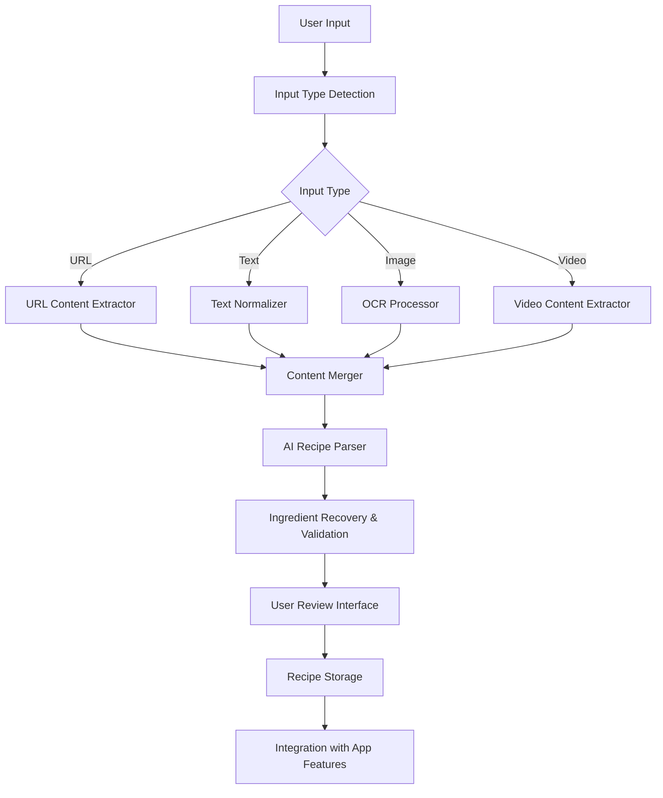
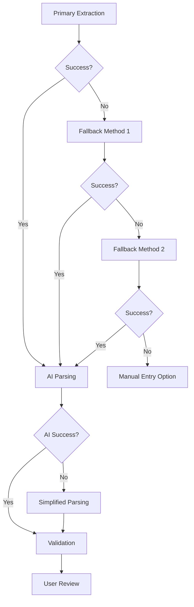

# Design Document

## Overview

The AI Recipe Import Optimization feature redesigns the existing recipe import system to provide reliable, intelligent processing of recipes from multiple sources. The design focuses on creating a robust pipeline with multiple fallback mechanisms, improved AI prompting strategies, and enhanced error handling to address current inconsistencies and reliability issues.

## Architecture

### High-Level Flow



### Core Components

1. **Input Detection Service**: Automatically classifies input type
2. **Content Extraction Pipeline**: Format-specific processors
3. **AI Recipe Parser**: Structured recipe extraction with improved prompts
4. **Validation Engine**: Ingredient recovery and consistency checking
5. **Review Interface**: User correction and approval system
6. **Storage Service**: Structured data persistence with metadata

## Components and Interfaces

### 1. Input Detection Service

```typescript
interface InputDetectionService {
  detectInputType(input: string | File): Promise<InputType>
  validateInput(input: string | File, type: InputType): Promise<boolean>
}

type InputType = 'url' | 'text' | 'image' | 'video'

interface DetectionResult {
  type: InputType
  confidence: number
  metadata?: {
    platform?: string
    fileType?: string
    size?: number
  }
}
```

### 2. Content Extraction Pipeline

```typescript
interface ContentExtractor {
  extract(input: string | File): Promise<ExtractedContent>
}

interface ExtractedContent {
  rawText: string
  metadata: {
    source: string
    extractionMethods: string[]
    confidence: number
    originalUrl?: string
    platform?: string
    creator?: string
  }
  fallbackUsed: boolean
}

// Specific extractors
interface URLExtractor extends ContentExtractor {
  extractStructuredData(url: string): Promise<StructuredRecipeData | null>
  extractVideoCaption(url: string): Promise<string | null>
  extractPageContent(url: string): Promise<string>
}

interface VideoExtractor extends ContentExtractor {
  extractCaptions(video: File): Promise<string | null>
  extractFrameText(video: File): Promise<string[]>
  transcribeAudio(video: File): Promise<string | null>
}

interface ImageExtractor extends ContentExtractor {
  performOCR(image: File): Promise<string>
  preprocessImage(image: File): Promise<File>
}
```

### 3. Enhanced AI Recipe Parser

```typescript
interface AIRecipeParser {
  parseRecipe(content: ExtractedContent): Promise<ParsedRecipe>
  validateAndRecover(recipe: ParsedRecipe, originalContent: string): Promise<ValidatedRecipe>
}

interface ParsedRecipe {
  title: string
  description?: string
  ingredients: ParsedIngredient[]
  instructions: string[]
  prepTime?: number
  cookTime?: number
  servings?: number
  difficulty?: string
  cuisine?: string
  confidence: number
}

interface ParsedIngredient {
  name: string
  quantity?: number
  unit?: string
  notes?: string
  confidence: number
  inferred: boolean
}

interface ValidatedRecipe extends ParsedRecipe {
  validationResults: {
    missingIngredients: string[]
    inferredQuantities: ParsedIngredient[]
    inconsistencies: ValidationIssue[]
  }
}
```

### 4. Improved AI Prompting Strategy

The current AI inconsistencies will be addressed through:

#### Multi-Stage Prompting
1. **Initial Parsing Prompt**: Focused on structure extraction
2. **Validation Prompt**: Cross-references ingredients with instructions
3. **Recovery Prompt**: Fills in missing information

#### Structured Output Format
```typescript
interface AIPromptTemplate {
  systemPrompt: string
  userPrompt: string
  outputSchema: JSONSchema
  examples: PromptExample[]
}

// Example structured output schema
const recipeOutputSchema = {
  type: "object",
  required: ["title", "ingredients", "instructions"],
  properties: {
    title: { type: "string" },
    ingredients: {
      type: "array",
      items: {
        type: "object",
        required: ["name"],
        properties: {
          name: { type: "string" },
          quantity: { type: "number" },
          unit: { type: "string" },
          confidence: { type: "number", minimum: 0, maximum: 1 }
        }
      }
    },
    instructions: {
      type: "array",
      items: { type: "string" }
    }
  }
}
```

### 5. Review Interface Components

```typescript
interface ReviewInterfaceProps {
  recipe: ValidatedRecipe
  originalContent: ExtractedContent
  onSave: (recipe: ValidatedRecipe) => void
  onEdit: (field: string, value: any) => void
  onCancel: () => void
}

interface QuickFixPanel {
  missingQuantities: IngredientQuantityFix[]
  optionalIngredients: IngredientOptionalToggle[]
  removeItems: RemoveItemAction[]
}
```

## Data Models

### Enhanced Recipe Storage Model

```typescript
interface StoredRecipe extends Meal {
  // Existing Meal properties plus:
  importMetadata: {
    source: InputType
    originalUrl?: string
    platform?: string
    creator?: string
    importedAt: Date
    extractionMethods: string[]
    aiConfidence: number
    userModified: boolean
  }
  validationData: {
    inferredIngredients: string[]
    uncertainQuantities: string[]
    userCorrections: UserCorrection[]
  }
}

interface UserCorrection {
  field: string
  originalValue: any
  correctedValue: any
  timestamp: Date
}
```

## Error Handling

### Fallback Strategy



### Error Recovery Mechanisms

1. **Network Failures**: Retry with exponential backoff, offline caching
2. **AI Parsing Failures**: Fallback to simpler prompts, manual entry option
3. **Content Extraction Failures**: Multiple extraction methods, user assistance
4. **Validation Failures**: Partial recipe saving with user notification

### User-Friendly Error Messages

```typescript
interface ErrorMessage {
  type: 'warning' | 'error' | 'info'
  title: string
  description: string
  actionable: boolean
  suggestedActions?: string[]
}

const errorMessages = {
  EXTRACTION_FAILED: {
    type: 'warning',
    title: 'Could not extract full recipe',
    description: 'Some information may be missing. Please review and add any missing details.',
    actionable: true,
    suggestedActions: ['Review ingredients', 'Check cooking steps', 'Add missing quantities']
  },
  AI_PARSING_FAILED: {
    type: 'error',
    title: 'AI processing failed',
    description: 'Unable to automatically parse the recipe. You can enter it manually.',
    actionable: true,
    suggestedActions: ['Try manual entry', 'Simplify input text', 'Contact support']
  }
}
```

## Testing Strategy

### Unit Testing
- Input type detection accuracy
- Content extraction for each format
- AI prompt response parsing
- Validation logic correctness
- Error handling scenarios

### Integration Testing
- End-to-end import flows
- Fallback mechanism triggers
- User interface interactions
- Database storage and retrieval
- Integration with existing app features

### AI Testing Strategy
- Prompt effectiveness measurement
- Output consistency across similar inputs
- Edge case handling (incomplete recipes, foreign languages)
- Performance benchmarking
- Confidence score accuracy

### Test Data Sets
- Sample URLs from major platforms (TikTok, Instagram, YouTube, food blogs)
- Various text formats (structured, unstructured, multilingual)
- Image samples (screenshots, photos, different qualities)
- Video samples (different lengths, qualities, with/without captions)

## Performance Considerations

### Optimization Strategies
1. **Parallel Processing**: Run multiple extraction methods simultaneously
2. **Caching**: Cache extracted content and AI responses
3. **Progressive Loading**: Show partial results while processing continues
4. **Request Batching**: Batch AI requests when possible
5. **Content Preprocessing**: Optimize content before AI processing

### Performance Targets
- Input type detection: < 100ms
- Content extraction: < 5 seconds
- AI parsing: < 10 seconds
- User review display: < 2 seconds
- Recipe saving: < 1 second

## Security and Privacy

### Data Handling
- Temporary storage of extracted content (auto-cleanup after 24 hours)
- No permanent storage of original media files
- User consent for AI processing
- Secure transmission of data to AI services

### Content Attribution
- Proper attribution storage for imported recipes
- Respect for platform terms of service
- User notification of attribution requirements
- Option to remove attribution if recipe is significantly modified

## Integration Points

### Existing NutriAI Components
1. **Meals Store**: Enhanced to handle import metadata
2. **Coach System**: Updated to consider import confidence scores
3. **Recipe Search**: Integration with imported recipe search
4. **Nutrition Analysis**: Support for imported recipe analysis
5. **Meal Planning**: Seamless integration with imported recipes

### External Services
1. **Supabase Edge Functions**: Enhanced AI proxy with better error handling
2. **OCR Service**: Integration with reliable OCR provider
3. **Video Processing**: Integration with video analysis services
4. **Social Media APIs**: Platform-specific content extraction

## Migration Strategy

### Existing Recipe Compatibility
- Backward compatibility with current recipe format
- Migration script for existing imported recipes
- Gradual rollout of new import features
- Fallback to old system if new system fails

### User Experience Transition
- Progressive enhancement of existing UI
- Optional beta testing for power users
- Clear communication of new capabilities
- Training materials and tooltips