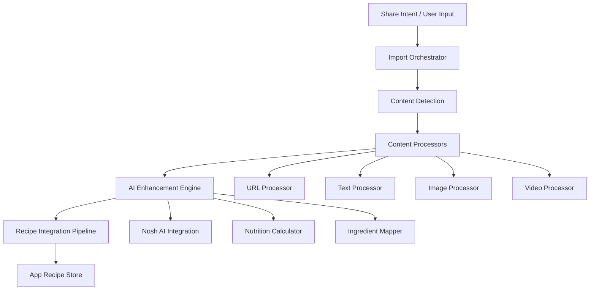

# Universal Recipe Import System Design

## Overview

The Universal Recipe Import System provides a comprehensive solution for importing recipes from any source with intelligent content processing, AI-powered enhancement, and seamless integration with the app's existing recipe ecosystem. The system uses a modular architecture with specialized processors for different content types, unified by a central orchestration layer.

## Architecture

### High-Level Architecture



### Core Components

#### 1. Import Orchestrator (`utils/importOrchestrator.ts`)
- Central coordination of import process
- Progress tracking and error handling
- Quality assessment and validation
- User feedback and retry logic

#### 2. Content Detection System (`utils/contentDetection.ts`)
- Automatic content type identification
- Platform-specific recognition (TikTok, Instagram, YouTube)
- Input validation and preprocessing
- Confidence scoring for detection accuracy

#### 3. Content Processors
- **URL Processor** (`utils/processors/urlProcessor.ts`): Web scraping and API integration
- **Text Processor** (`utils/processors/textProcessor.ts`): Natural language recipe parsing
- **Image Processor** (`utils/processors/imageProcessor.ts`): OCR and visual content extraction
- **Video Processor** (`utils/processors/videoProcessor.ts`): Multi-modal video content analysis

#### 4. AI Enhancement Engine (`utils/aiEnhancement.ts`)
- Integration with existing Nosh AI system
- Missing ingredient inference
- Quantity and unit standardization
- Nutrition calculation and enrichment

#### 5. Recipe Integration Pipeline (`utils/recipeIntegration.ts`)
- Format conversion to app's native recipe structure
- Ingredient database mapping
- Duplicate detection and merging
- Metadata enrichment

## Components and Interfaces

### Import Orchestrator Interface

```typescript
interface ImportOrchestrator {
  processImport(input: ImportInput, options?: ImportOptions): Promise<ImportResult>;
  getProgress(importId: string): ImportProgress;
  cancelImport(importId: string): Promise<void>;
}

interface ImportInput {
  content: string | File | URL;
  type?: 'auto' | 'url' | 'text' | 'image' | 'video';
  source?: 'share' | 'manual' | 'clipboard';
}

interface ImportResult {
  success: boolean;
  recipe?: ProcessedRecipe;
  confidence: number;
  processingSteps: ProcessingStep[];
  validationResults: ValidationResult[];
  error?: ImportError;
}
```

### Content Processor Interface

```typescript
interface ContentProcessor {
  canProcess(input: ImportInput): boolean;
  process(input: ImportInput): Promise<RawRecipeData>;
  getConfidence(): number;
  getSupportedPlatforms(): string[];
}

interface RawRecipeData {
  title?: string;
  description?: string;
  ingredients: string[];
  instructions: string[];
  metadata: RecipeMetadata;
  source: SourceInfo;
}
```

### AI Enhancement Interface

```typescript
interface AIEnhancementEngine {
  enhanceRecipe(raw: RawRecipeData): Promise<EnhancedRecipe>;
  inferMissingIngredients(instructions: string[]): Promise<string[]>;
  standardizeQuantities(ingredients: string[]): Promise<StandardizedIngredient[]>;
  calculateNutrition(recipe: EnhancedRecipe): Promise<NutritionInfo>;
}
```

## Data Models

### ProcessedRecipe Model

```typescript
interface ProcessedRecipe {
  id: string;
  title: string;
  description?: string;
  image?: string;
  source: SourceInfo;
  ingredients: ProcessedIngredient[];
  instructions: ProcessedInstruction[];
  nutrition?: NutritionInfo;
  metadata: RecipeMetadata;
  processingInfo: ProcessingInfo;
}

interface ProcessedIngredient {
  name: string;
  original: string;
  amount?: number;
  unit?: string;
  confidence: number;
  mappedToDatabase?: boolean;
  databaseId?: string;
}

interface ProcessingInfo {
  importedAt: Date;
  processingTime: number;
  confidence: number;
  aiEnhanced: boolean;
  validationPassed: boolean;
  processingSteps: ProcessingStep[];
}
```

### Content Detection Model

```typescript
interface ContentDetectionResult {
  type: 'url' | 'text' | 'image' | 'video';
  platform?: 'tiktok' | 'instagram' | 'youtube' | 'website';
  confidence: number;
  metadata: ContentMetadata;
  processingHints: ProcessingHint[];
}

interface ProcessingHint {
  processor: string;
  priority: number;
  configuration: Record<string, any>;
}
```

## Error Handling

### Error Classification

```typescript
enum ImportErrorType {
  CONTENT_INACCESSIBLE = 'content_inaccessible',
  PARSING_FAILED = 'parsing_failed',
  AI_ENHANCEMENT_FAILED = 'ai_enhancement_failed',
  VALIDATION_FAILED = 'validation_failed',
  INTEGRATION_FAILED = 'integration_failed',
  NETWORK_ERROR = 'network_error',
  RATE_LIMITED = 'rate_limited'
}

interface ImportError {
  type: ImportErrorType;
  message: string;
  details?: Record<string, any>;
  recoverable: boolean;
  suggestedActions: string[];
}
```

### Fallback Strategy

1. **Primary Processing Failure**: Attempt alternative processors
2. **AI Enhancement Failure**: Continue with basic extracted data
3. **Network Issues**: Cache and retry with exponential backoff
4. **Validation Failure**: Allow user to manually correct and revalidate
5. **Complete Failure**: Provide manual entry option with extracted content as reference

## Testing Strategy

### Unit Testing
- Individual processor functionality
- Content detection accuracy
- AI enhancement quality
- Error handling scenarios

### Integration Testing
- End-to-end import workflows
- Cross-platform compatibility
- Performance under load
- Error recovery mechanisms

### User Acceptance Testing
- Real-world content import scenarios
- User interface usability
- Import accuracy validation
- Performance expectations

### Test Data Strategy
- Curated test content from major platforms
- Edge cases and error scenarios
- Performance benchmarking datasets
- User-generated content samples

## Implementation Phases

### Phase 1: Core Infrastructure
1. Import orchestrator and progress tracking
2. Content detection system
3. Basic URL and text processors
4. Enhanced import modal UI

### Phase 2: Advanced Processing
1. Image OCR processor with preprocessing
2. Video content extraction (audio + visual)
3. Platform-specific optimizations
4. AI enhancement integration

### Phase 3: Integration & Polish
1. Recipe integration pipeline
2. Share intent handling
3. Batch import capabilities
4. Performance optimizations

### Phase 4: Advanced Features
1. Duplicate detection and merging
2. User learning and personalization
3. Community validation features
4. Analytics and monitoring

## Platform-Specific Implementations

### TikTok Integration
- Video download and processing
- Audio transcription for recipe narration
- Text overlay extraction from video frames
- Hashtag and description parsing

### Instagram Integration
- Post and story content extraction
- Caption and comment parsing
- Image text recognition
- Reel video processing

### YouTube Integration
- Video description parsing
- Closed caption extraction
- Timestamp-based content segmentation
- Channel-specific recipe format recognition

### Recipe Website Integration
- Schema.org structured data extraction
- Site-specific parsing rules
- Advertisement and navigation filtering
- Image and metadata preservation

## Performance Considerations

### Processing Time Targets
- Text/URL imports: < 3 seconds
- Image imports: < 10 seconds
- Video imports: < 30 seconds
- Batch imports: < 60 seconds total

### Optimization Strategies
- Parallel processing for independent operations
- Caching of processed content and AI results
- Progressive enhancement with immediate basic results
- Resource cleanup and memory management

### Scalability Measures
- Rate limiting for external API calls
- Queue-based processing for heavy operations
- CDN integration for media content
- Database indexing for fast lookups

## Security and Privacy

### Data Protection
- Temporary storage with automatic cleanup
- Encrypted transmission of sensitive content
- User consent for AI processing
- Minimal data retention policies

### Content Rights
- Source attribution preservation
- Copyright compliance measures
- User responsibility disclaimers
- DMCA takedown procedures

## Monitoring and Analytics

### Success Metrics
- Import success rates by content type
- Processing time distributions
- User satisfaction scores
- Recipe usage after import

### Error Tracking
- Failure categorization and trends
- Performance bottleneck identification
- User abandonment points
- Recovery success rates

### Quality Metrics
- Extraction accuracy measurements
- AI enhancement effectiveness
- User correction frequency
- Recipe completeness scores

## Future Enhancements

### Planned Features
- Real-time collaborative recipe editing
- Community recipe validation
- Machine learning model improvements
- Multi-language recipe support

### Integration Opportunities
- Direct API partnerships with platforms
- Third-party recipe database integration
- Nutrition service partnerships
- Smart kitchen device connectivity

This design provides a robust, scalable foundation for universal recipe import while maintaining flexibility for future enhancements and platform-specific optimizations.