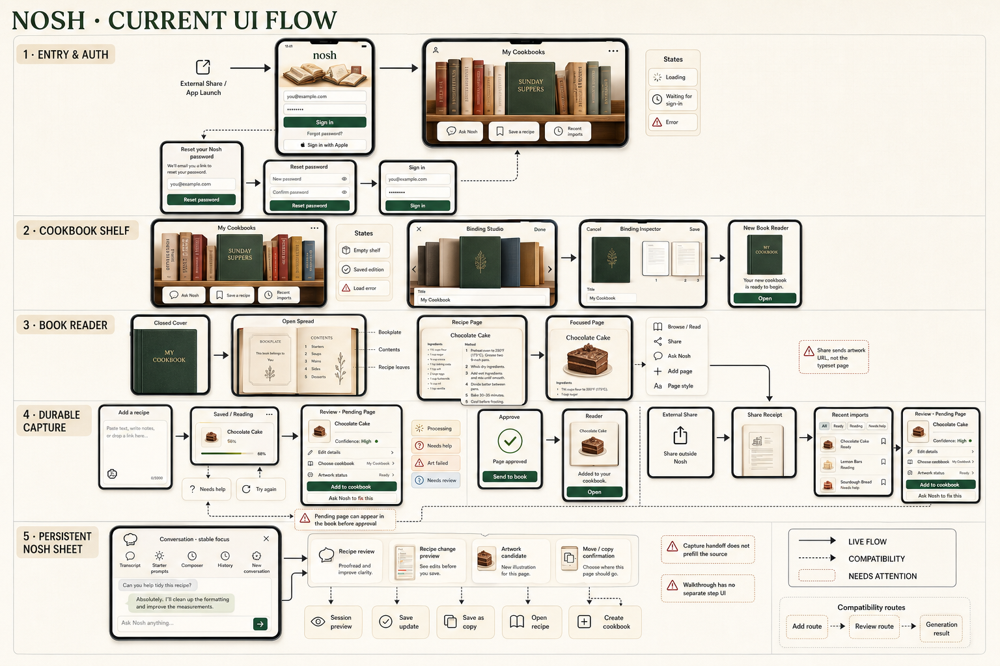
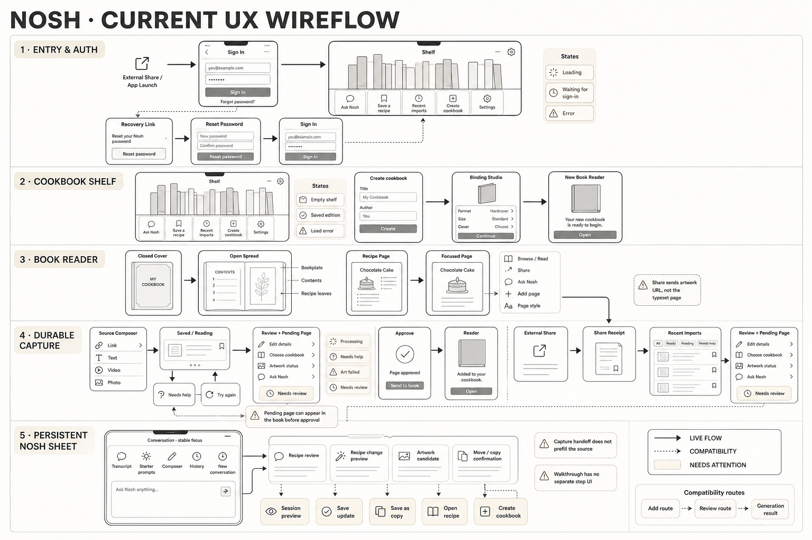

# Nosh UX inventory and wireflow — pre-simplification snapshot

> Historical note: this scan predates the 2026-08-22 single capture-to-page pipeline. Its review, approval, table-of-contents, and split typesetter/art flows are no longer current. See `README.md` and `docs/ARCHITECTURE.md` for the active implementation.

## Current UI flow



## Structural wireflow



## What this document represents

This is a reconstruction of the current working tree as scanned on 2026-08-22. It describes what the code can render and how the implemented states connect. It does not treat older plans or architecture documents as product truth.

The local `.env` does not set `EXPO_PUBLIC_NOSH_CONTEXT_MODEL_V2`, so the flag resolves to `false`. The default experience therefore uses the compact shelf Nosh button and the compatibility conversation copy that accepts recipe links, photos, video, and general questions in one composer. The V2 collection, recipe, and capture-specific presentation is implemented behind the flag and is recorded separately where it changes the UX.

The working tree contains a large set of uncommitted changes. This inventory describes those files as they exist now. It is not a statement about what has reached production.

## Product shape at a glance

The live product has six main experiences:

1. Authentication and recovery.
2. A physical cookbook shelf.
3. A binding and page-style creation studio.
4. A physical book reader with spread and single-page modes.
5. A durable recipe capture queue, review workspace, and native share receipt.
6. A root-mounted Nosh conversation sheet that keeps its transcript and focus while routes change.

There is no tab bar and no navigation drawer. The shelf is the home screen. Secondary experiences open as stack routes, a small library popover, bottom sheets, focused full-screen overlays, native alerts, and the operating system share sheet.

## Global shell, routing, and cross-app states

### App startup and route guard

Implementation: `app/_layout.tsx`

Entry points:

- Normal app launch.
- Any internal or deep-linked route.
- Supabase email confirmation, magic-link, OAuth, or password-recovery callback using the `nosh://` scheme.
- Native Share to Nosh handoff on iOS or Android.

Visible states and transitions:

| State | What appears | Available action or automatic exit |
|---|---|---|
| Fonts, session, or callback still loading | Full-screen activity indicator and "Opening your cookbook..." | No user action. Continues to auth or the shelf. |
| Signed out | Auth guard replaces non-auth routes with Sign in | Sign in, sign up, or recover account. |
| Signed in | Auth guard replaces non-book routes with the shelf, except the reset-password route | Continue into shelf or reader route. |
| Valid normal auth callback | Session is exchanged or installed | Route is replaced with the shelf. |
| Valid recovery callback | Recovery session is verified or installed | Route is replaced with Reset password. |
| Callback contains an auth error | Error is logged, but there is no callback-specific error screen | Existing route guard decides where the user lands. |

### Root-mounted overlays and invisible workers

These exist above every route:

- **Nosh conversation sheet.** A bottom sheet, up to 88% of the screen, with persistent runtime, device-local threads, and contextual tools.
- **Offline banner.** A fixed top banner saying "No internet connection." It disappears when connectivity returns. It has no action.
- **Toast.** Success, error, or information notice near the bottom. It can auto-dismiss, close manually, or run an optional action. Current route code rarely invokes it directly.
- **Global error screen.** Replaces the whole app after an uncaught React error. It shows the message and component stack, including development-oriented language, with no retry or reset action.
- **Native share ingestion worker.** Invisible. It reads an incoming share, waits for auth and network, starts a durable capture, then updates the share receipt route.
- **Capture resume worker.** Invisible. It retries captures that have been in `reading` for more than ten minutes after restoration.

## Complete route and surface inventory

## Authentication

All auth screens use the same centered Nosh wordmark, optional reading illustration, explanatory copy, and white form card.

### Sign in

Route: `/(auth)/sign-in`

Entry points:

- Signed-out launch or attempted access to a book route.
- Auth index redirect.
- Sign-up footer.
- Forgot/reset-password completion.
- A native share received while signed out.

Major actions:

- Enter email and password, then sign in.
- Send a magic link to the entered email.
- Continue with Google OAuth.
- Continue with Apple when the platform reports Apple sign-in support.
- Open Forgot password.
- Open Create account.

States:

- Missing email or password produces inline validation.
- All sign-in methods share one `loading` flag. Password and secondary buttons disable; the Apple button becomes a spinner.
- Network and auth failures appear inline and in a native alert.
- A native share waiting for authentication adds a notice: the handoff remains on the device and will save after sign-in.
- Successful password or Apple sign-in replaces the route with the shelf. OAuth and magic-link completion return through the app URL callback.

Notable inconsistency: sign-up navigates back with an `email` route parameter, but Sign in never reads it, so the address is not prefilled.

### Sign up

Route: `/(auth)/sign-up`

Entry points: Sign-in footer or a direct/deep-linked route.

Major actions:

- Create an account with email, password, and confirmation.
- Continue with Apple when available.
- Return to Sign in.

States and exits:

- Missing fields, mismatched passwords, and passwords shorter than six characters show inline errors.
- Submission disables the form action and shows loading.
- Auth failures show inline and as a native alert.
- If email verification is required, a native alert explains it and the route is replaced with Sign in.
- If Supabase returns a session immediately, there is no explicit navigation in the email handler. The root auth guard is expected to move the user to the shelf.
- Apple sign-up also relies on the auth guard rather than navigating explicitly.

### Forgot password

Route: `/(auth)/forgot-password`

Entry points: Sign in or direct route.

Major actions:

- Enter email and send reset link.
- Go back to Sign in.
- After success, resend email or replace the route with Sign in.

States:

- Missing email shows an inline error.
- Sending disables actions and shows button loading.
- Failure shows inline and in a native alert.
- Success replaces the form with a "Check your email" confirmation containing the submitted address.

### Reset password

Route: `/(auth)/reset-password`

Entry point: password recovery callback, or direct route.

Major actions:

- Enter and confirm a new password.
- Return to Sign in.

States and exits:

- Initial session check shows a full-screen spinner.
- Without a recovery session, the screen remains visible but fields and submit are disabled. Copy tells the user to reopen the email link.
- Short or mismatched passwords show inline errors.
- Update failure shows inline and in a native alert.
- Success signs out the local session, shows a native confirmation alert, then replaces the route with Sign in when OK is pressed.

## Shelf and collection navigation

### Shelf

Route: `/(book)`

Implementation: `app/(book)/index.tsx`, `components/shelf/ShelfScene.tsx`

Entry points:

- Successful authentication.
- Back from a cookbook.
- Completion or cancellation of the native share receipt.
- Auth guard for any signed-in non-book route.

Major UI:

- "My Cookbooks" heading and physical shelf carousel.
- One centered book faces forward. Neighboring books present as spines.
- A dashed trailing volume creates a cookbook.
- Current book title and approved recipe count below the shelf.
- Nosh launcher at upper right.
- "Save a recipe" button.
- "Recent imports" button with a needs-attention badge.
- Ellipsis menu in the top bar.

Major actions and exits:

- Swipe or drag the shelf to center another volume.
- Tap an off-center volume to center it.
- Tap the centered cookbook to push its reader route.
- Tap the trailing create volume to push Creation studio.
- Tap ellipsis to open the library popover.
- Tap Settings in the popover to push Settings.
- Tap Nosh to open the conversation sheet with collection focus.
- Tap Save a recipe to open the Nosh sheet directly in durable capture mode, with no destination cookbook.
- Tap Recent imports to push the capture queue.

States:

- First load with no cached books shows a full-screen spinner.
- Load error with no books shows a safe-data error card with Try again.
- Cached books plus refresh failure show a "Saved edition" stale notice with Refresh.
- Empty shelf still renders the create volume and explains how to create the first cookbook.
- The imports badge counts `ready_to_review` and `needs_help` captures only. It caps visually at `9+`.
- The shelf count includes approved pages only, even though the reader can show pending review pages.

### Library popover

Parent: Shelf.

Entry point: shelf ellipsis.

Contents and actions:

- Dimmed backdrop.
- One item: Settings, with "Account and library details."
- Tap outside to close.
- Tap Settings to close the popover and push Settings.

There is no cookbook rename, delete, reorder, or shelf-management action in this menu.

### Creation studio, binding browse

Route: `/(book)/library`, browse mode.

Entry points:

- Shelf create volume.
- Nosh's create-cookbook tool closes the conversation and pushes this route.
- Direct route.

Major actions:

- Swipe the binding shelf.
- Tap the centered binding to inspect it.
- Tap the top-left back button to return to the prior route.

State:

- The active preset's name and tagline change as the shelf moves.
- There is no loading state for preset assets.

### Creation studio, binding inspector

Same route, local `inspect` mode.

Major UI:

- Animated open-book binding preview.
- Material, finish, foil, and related binding summary.
- Horizontal page-style cards with selected checkmark.
- Cookbook title field, maximum 48 characters.
- "Use This Binding" action.

Actions and exits:

- Choose a page style.
- Edit the title.
- Return to All bindings.
- Create the cookbook. Success replaces the route with the new reader.
- If somehow rendered without a signed-in user, the CTA becomes "Sign in to save" and pushes Sign in.

States:

- Empty title disables create.
- Submission locks the title field, disables the CTA, and shows a spinner.
- Create failure appears inline and re-enables the form.

### Settings

Route: `/(book)/settings`

Entry point: shelf library popover or direct route.

Major UI:

- Account email.
- Cookbook count.
- Sign out.
- Delete account.

Actions and exits:

- Library back uses route back when possible, otherwise replaces with the shelf.
- Sign out clears the session and replaces with Sign in.
- Delete account opens a destructive native confirmation alert. Confirming deletes remote account data, tries to clear local shelf/page caches, clears React Query, signs out, and replaces with Sign in.

States:

- Signing out changes the row label and disables both account actions.
- Deleting changes the row label and disables both account actions.
- Sign-out and deletion errors appear in native alerts.
- Missing user during delete produces a "Sign in required" alert.

There is no UI for deleting one cookbook even though the hook and API support it.

## Cookbook reader and recipe reading

### Reader route loading and errors

Route: `/(book)/[cookbookId]`

Entry points:

- Tap a shelf cookbook.
- Create a cookbook.
- Approve a capture.
- Nosh opens a saved recipe.
- Nosh creates, moves, or copies a recipe page.
- Deep link with optional `pageId` query parameter.

States:

- With no cookbook metadata at all, initial load shows a full-screen spinner.
- Shelf metadata is reused immediately, so the cover can render while pages load.
- Cookbook/page load failure without usable data shows Try again and Back to shelf.
- Missing cookbook shows a not-found card and Back to shelf.
- Cached content plus refresh failure shows the stale "Saved edition" notice with Refresh.

### Closed book and opening transition

Entry:

- Opening from the shelf briefly paints a closed physical cover, then auto-opens it after 100 ms.
- A deep link with `pageId` starts open at the matching recipe.

Actions:

- Tap or swipe the cover to open.
- Tap Library in the top bar to replace with the shelf.
- At the first spread, a backward swipe can close the front cover.
- At the final spread, a forward swipe can close the back cover; a backward swipe reopens it.

The top and bottom reader controls auto-fade after 3.5 seconds on every platform. Mouse movement, touch, turns, and stage taps restore them.

### Open book, spread browsing

Major leaves:

- Bookplate with title and recipe count.
- Table of contents.
- Recipe leaves in pairs.
- Blank final leaf when necessary.

Major actions:

- Drag page edges or use Previous/Next controls to move through spreads.
- Tap a table-of-contents row to jump to a recipe.
- Tap a recipe leaf to open the focused full-page overlay.
- Tap "Read" to switch to single-page reading.
- Tap the counter on layouts that do not use compact native touch paging to close the book.
- Tap the top share icon to open the OS share sheet for the selected recipe.
- Tap Ask Nosh to open the contextual conversation.
- Tap page-style icon to open the page-style bottom sheet.
- Tap plus to open durable recipe capture inside the Nosh sheet, scoped to this cookbook.

Platform differences:

- Compact native screens use physical one-leaf paging in Read mode and count bookplate, contents, recipe, and blank leaves.
- Web and wider layouts keep spread behavior and explicit arrow controls.
- Web builds their own 3D textures and handle table-of-contents hit testing on the rendered canvas.

### Table of contents

Surface: first interior spread.

Contents:

- Recipes grouped into configured cookbook sections.
- Page number, title, and section counts.
- Pending pages marked "Needs review."
- Approved page count in the heading.

States and actions:

- Empty book says no recipe pages exist and points toward adding a page, but the empty contents page itself has no add button.
- Tap any listed row to jump to that page.
- Pending review pages are included in sections and remain tappable even though the heading count excludes them.

### Single-page reading and focused recipe overlay

There are two full-page concepts:

- **Read mode.** The physical reader presents one leaf at a time on compact native screens.
- **Focused recipe overlay.** Tapping a recipe in the book opens an animated full-screen layer over the reader on all supported layouts.

Focused overlay actions:

- Return through the top "Cookbook" action.
- Return through the bottom "Back to cookbook" action.
- Android hardware Back closes the overlay first.
- Share the focused recipe.

State:

- A temporary Nosh recipe mutation adds a "Session preview" badge and swaps the visible RecipeGraph without persisting it.
- Leaving the focused overlay returns to the open physical book, not the shelf.

### Page rendering states

Implementation: `PageCanvas`, `TypesetterPage`, `ArtLayer`, `TextLayer`.

- New pages with a RecipeGraph render live selectable text immediately.
- Artwork loads independently into the upper art zone. Missing or still-generating artwork leaves that zone blank while the text remains usable.
- Pending capture pages add a "Needs review" badge.
- Legacy pages render a full-page image.
- A legacy page without an image shows a skeleton with the title and "Page artwork is being prepared."

### Page-style bottom sheet

Entry point: layout icon in an open book.

Actions:

- Scroll horizontally through template previews.
- Tap one to set the cookbook default for future pages and close the sheet.
- Tap X, backdrop, or system back to close without changing.

State and caveat:

- The currently selected style has a checkmark.
- Existing pages keep their original template.
- The sheet closes immediately. Update progress and failure are not shown to the user.

### Share current recipe

Entry points: top reader action or focused overlay.

Result:

- If `page.imageUrl` exists, the operating system share sheet opens with the recipe title and that URL.
- In the new pipeline, `imageUrl` maps to the selected generated artwork version. It is the illustration, not a captured image of the complete typeset page.
- If no selected artwork exists, a native "Share unavailable" alert says the page is not ready, even though the text page may already be fully readable.

## Durable recipe capture and import review

### Capture composer

Surface: `NoshCaptureWorkspace` with no resolved capture.

Reachable entry points:

- Shelf "Save a recipe," inside the Nosh sheet with no destination.
- Reader plus button, inside the Nosh sheet with the current cookbook as destination.
- Dedicated add route, when reached directly or from the compatibility generation screen.
- Conversation handoff card after "Start capture."
- A missing capture ID can also fall back to this composer once loading ends.

Major actions:

- Paste a recipe URL.
- Paste recipe text.
- Paste a recognized YouTube, TikTok, Instagram, reel, shorts, or video-file URL.
- Attach one image from the photo library.
- Add optional notes with an image.
- Remove or replace the image.
- Save the source.

States:

- Composer labels its detected input as Image, Video link, Recipe link, or Recipe text.
- Empty input with no image disables Save recipe.
- Photo permission denial closes the picker path silently. There is no explanatory alert here.
- During save, the input and attachment actions disable and the label becomes "Saving recipe."
- Save/upload errors appear inside the composer. The current durable workspace does not pass an `onRetry`, so the error panel has no separate Try again button; the user can press Save recipe again.
- Submitted input is local component state. Leaving before submission discards it.

### Capture saved/reading card

Shown for `saved` and `reading` statuses.

- Copy says the source is saved and Nosh is reading it.
- It explicitly permits leaving the screen.
- There is no cancel, manual refresh, open-queue, or retry action on this card.
- The capture hook polls every 2.5 seconds while any capture is processing or generating art.

### Capture needs-help card

Shown for `needs_help`.

- Displays the stored failure message.
- Try again reclaims the capture and restarts processing.
- Retry shows button loading.
- There is no edit-source or replace-source action. If the same source is unusable, the user must leave and start another capture.

### Capture review and finished-page preview

Shown when a capture has a RecipeGraph, normally `ready_to_review`.

Major UI:

- Optional finished-page preview when a pending page has been prepared.
- Source attribution.
- Title, servings, ingredient count, step count, confidence, inferred fields, and first extraction note.
- Collapsible editor.
- Destination selection.
- Artwork/preparation status.
- Approval button.
- Optional "Ask Nosh to fix this."

Editor actions:

- Edit title and servings.
- Edit ingredient names only. Quantity, unit, optional flags, and group structure are not editable here.
- Edit step text.
- Save changes or close the editor.

Destination and approval states:

- A capture started inside a cookbook already has a destination and begins pending-page/art preparation during extraction.
- An unknown-destination capture asks the user to choose one of their cookbooks. Choosing starts pending-page and art preparation.
- While preparation, draft update, retry, or approval runs, relevant actions disable and buttons can show loading.
- Approval stays disabled until a destination, pending page, and completed-or-failed art outcome exist. It also stays disabled while the editor is open.
- If art succeeds, copy says the finished page is ready.
- If art fails, the recipe remains approvable and copy says art can be regenerated later.
- A retry-preparation action appears only when art failed and no pending page exists.
- "Ask Nosh to fix this" opens recipe-focused conversation for the pending page.
- Approval changes the capture to `added` and opens the reader at the page.

Important edge state: when the user has no cookbook and the capture has no destination, the destination area contains no buttons. Approval remains disabled with "Choose a cookbook first," but this card has no create-cookbook action. The user must discover the shelf creation flow on their own.

### Capture added card

Shown for `added` when the capture is opened directly.

- Confirms it was added.
- "Open recipe" replaces the route with the destination reader when both IDs exist.
- If either ID is missing, the button remains visible but does nothing.

### Recent imports list

Route: `/(book)/imports`

Entry points:

- Shelf Recent imports.
- Native share receipt "Open in Nosh."
- V2 collection conversation starter "Review recent imports."
- Direct route, optionally with `captureId`.

Major actions:

- Back to the prior route.
- Filter All, Ready, Reading, or Needs help.
- Open a capture by setting `captureId` in the same route.

States:

- `saved` and `reading` are grouped under Reading.
- `ready_to_review` and `needs_help` have their own filters.
- Added captures are excluded from every list. "Recent imports" is therefore an unfinished-work inbox, not a history.
- Empty filter state says "Nothing in this view."
- There is no explicit loading, stale-cache, refresh, or query-error surface for the list. An initial empty query can look like a genuine empty inbox.
- Once a capture is open, the filters and list disappear. The route header back action leaves the imports route rather than returning to the imports list. Clearing `captureId` is not exposed in UI.

### Native Share to Nosh receipt

Route: `/(book)/share`

External entry support:

- iOS share extension accepts text, one web URL/page, or one image.
- Android accepts `text/*` and `image/*` single-item intents.
- Web and Expo Go disable share-intent processing.
- Image shares larger than 15 MB fail before upload.
- If an image and text arrive together, the image wins and text becomes notes.
- Text containing a URL becomes a URL capture.
- Duplicate OS deliveries within ten minutes reuse an idempotency key.

Receipt states:

| State | Surface and actions |
|---|---|
| Waiting for sign-in | The auth guard shows Sign in with a share-waiting notice. The receipt route itself has no branch for this status. |
| Saving | Spinner, "Saving the recipe source," and copy asking the user to keep Nosh open. No cancel. |
| Saved | Confirmation. "Open in Nosh" opens the exact capture in Recent imports. "Done" clears the in-memory receipt and returns to the shelf. |
| Failed | Error message. "Try saving again" increments a retry token. "Cancel shared item" clears the OS share intent and returns to the shelf. |
| Idle/direct route | "No shared recipe is waiting" and a link to Recent imports. |
| Offline | Failed receipt explains the handoff remains on-device and can be retried after reconnecting. |

The receipt says the user can return to the app they shared from, but the implemented Done action returns to the Nosh shelf. There is no explicit return-to-source-app action.

## Dedicated and compatibility routes

### Dedicated add-page route

Route: `/(book)/[cookbookId]/add`

- Shows a full-page "Add a page to [cookbook]" header and the same durable capture workspace.
- Back replaces with the cookbook reader.
- Approval replaces with the reader at the new page.
- The current reader plus button does not navigate here. It opens capture in the Nosh sheet instead.
- The route remains reachable from the compatibility generation screen, direct links, and older callers.

### Compatibility review route

Route: `/(book)/[cookbookId]/review`

- Requires `captureId` and renders the durable capture workspace, not the retired `RecipeReviewForm`.
- Missing `captureId` immediately replaces with the dedicated add route and renders nothing during the redirect.
- No current in-app action navigates to this route.

### Compatibility generation result

Route: `/(book)/[cookbookId]/generation/[pageId]`

- Valid page shows "Page added," a page preview, View in book, and Add another page.
- Missing, `temp`, or unknown page shows "Page not found" and Back to cookbook.
- Current durable and conversation creation flows open the reader directly and do not navigate here.

## Contextual Nosh experience

### Where Nosh appears

- Shelf launcher with collection focus.
- Shelf Save a recipe opens the Nosh sheet directly as a capture workspace.
- Reader action dock with the selected recipe as focus.
- Reader plus button opens the capture workspace with the current cookbook as destination.
- Capture review can open Nosh focused on the pending recipe page.
- The conversation itself can navigate to recipe, cookbook creation, imports, and capture experiences.

### Conversation sheet structure

Surface: root-mounted `Sheet`.

Major UI:

- Nosh identity, current focus label, and current thread title.
- Conversation history action.
- New conversation action.
- Close X, backdrop dismissal, and system-back dismissal.
- Transcript of user and assistant bubbles.
- Inline tool cards.
- Empty-thread introduction and starter prompts.
- Composer with Send or Stop while the assistant runs.
- Optional attached recipe-photo pill.
- Progress card while extraction or page creation runs.

States:

- Running requests show a Stop action and contextual progress. After eight seconds the copy changes to a longer-running reassurance.
- A new conversation is disabled while the current thread is running.
- If a conversation remains focused on one recipe and the user opens Nosh from a different recipe, a focus-change card offers either reusing the current conversation or starting a new one.
- Missing recipe focus changes the context label to "unavailable." The assistant still opens, but recipe tools receive no canonical graph.
- The transcript survives route changes because the runtime lives at the app root.
- Threads and messages are saved privately on the device and scoped by user ID.

### Default flag-off presentation

This is the current local behavior.

- Shelf launcher is a round chef-hat icon without descriptive text.
- Empty conversation title is "What are we cooking?"
- General and recipe contexts share the broad copy: links, recipe photos, video, or a food request.
- The composer always allows a photo and says "Drop a recipe link or ask Nosh..."
- Recipe-focused starter prompts include scaling, substitution, walkthrough, and timer.
- Collection starter prompts include adding a link, reading a photo, and choosing dinner.

### V2 flag-on presentation

Implemented for internal builds but off locally.

- Shelf launcher expands to "Ask Nosh / Find, plan, and organize."
- Collection conversation removes photo intake and emphasizes search, planning, recent imports, organization, and cookbook creation.
- Recipe conversation removes photo intake and names the active recipe.
- Capture task uses a dedicated recipe source composer.
- A collection starter can close the sheet and push Recent imports.

### Context Nosh sends to the model

The interaction model separates stable conversation focus from what the reader currently shows.

- **Collection focus:** collection task, list of available cookbook IDs and titles, and visible context.
- **Cookbook focus:** cookbook ID, title, style, and available destinations.
- **Recipe focus:** cookbook ID, page ID, canonical RecipeGraph, current artwork presence, and focus load status.
- **Visible context:** current cookbook and page may change as the physical reader turns without automatically changing the saved thread focus.
- **Capture focus:** capture task and optional destination cookbook.
- **Attached photo:** only a boolean reaches the model context; base64 and MIME data stay client-side until the extraction tool runs.

### Conversation history surface

Entry point: history icon, hidden during capture mode.

Actions:

- Open a saved conversation.
- Start a new conversation.
- Rename a thread with save/cancel controls.
- Delete a thread through an inline Keep/Delete confirmation.
- Return to the current conversation.

States:

- Loading says "Opening your recipe journal..."
- Empty says no conversations have been saved yet.
- Running threads say "Nosh is still working."
- Current thread and saved thread receive different metadata.
- Rename/delete failures use native alerts.

### Nosh inline action cards and effects

| Tool/card | User-visible action | Result |
|---|---|---|
| Start recipe capture | Start capture or Not now | Switches the whole Nosh sheet from chat to the durable capture workspace. The source arguments shown in the handoff are not prefilled into that workspace. |
| Extract recipe | Status card while URL, text, image, or video is read | Produces a draft for the conversation review card. This is the older direct extraction path, separate from durable captures. |
| Conversation recipe review | Edit title, servings, ingredient quantity/unit/name, and step text; reveal destinations; request changes; approve | Stores the approved graph, then the model can create a page. No durable capture row is involved. |
| Select cookbook | Choose a cookbook or create one if none exist | Sets destination. Create closes Nosh and opens Creation studio. |
| Create page | Automatic after approved graph | Creates live page, opens reader immediately, then creates art in the background. |
| Search collection | Automatic status card | Returns up to five candidates for the model to resolve. |
| Load/open recipe | Automatic status cards | Loads canonical graph or navigates reader to the selected recipe. |
| Move/copy recipe | Loads exact source/destination preview, then Cancel or Confirm | Refreshes shelf and page caches, navigates to the result, and changes conversation focus. |
| Scale servings | Preview; use this session, save update, save as copy, or cancel | Temporary mode swaps the visible graph; update persists; copy creates another page. |
| Substitute ingredient | Same confirmation modes as scaling | Applies proposed substitution temporarily or persistently. |
| Update page data | Same confirmation modes | Applies model-generated graph patch operations. |
| Regenerate artwork | Generate or Cancel; then Use new artwork or Keep current | Candidate does not replace current art until explicit approval. |
| Start timer | Automatic tool card | Schedules an in-memory JavaScript timeout and later shows a native alert. |
| Guide next step | Automatic tool card | Logs the requested step ID. It does not currently highlight or navigate the visible page. |
| Walkthrough state | Automatic tool card | Changes the interaction entry point/task. No separate walkthrough screen, step tracker, or page highlight appears. |

## Important duplicated, disconnected, ambiguous, and dead-end flows

These are observations, not redesign proposals.

### Two recipe-import systems are live

1. Durable capture saves a source first, processes in the background, creates a pending page, and requires explicit approval.
2. Conversation import calls extraction directly, displays a separate review card, creates an approved page immediately, and starts artwork afterward.

They use different editors, status models, destination handling, persistence behavior, and artwork timing. A user can reach both from Nosh depending on how the assistant responds.

### Approval wording does not match page visibility

Durable capture creates a real pending cookbook page before approval when a destination is known. The reader fetches all pages, and the table of contents includes pending pages with "Needs review." Shelf counts exclude them. Copy such as "before adding it to your cookbook" and the approval CTA imply the page does not enter the book until approval, but it can already be read there.

### Three add/review/result route families remain

- Reader plus opens capture inside the Nosh sheet.
- `/(book)/[cookbookId]/add` renders the same capture workspace as a full route.
- `review` and `generation/[pageId]` remain as compatibility routes.

The current successful flows bypass review and generation routes, leaving them mostly for deep links and older callers.

### Retired components remain on disk with no live caller

They describe older variations of import, review, creation, and shelf UX but are not rendered by current routes:

| Dormant surface | UX still implemented in the component |
|---|---|
| `AddPageComposer` | Source-hinted URL, text, image, or video intake with a retry panel and "Review recipe" action. Superseded by `UnifiedIntakeComposer`. |
| `RecipeReviewForm` | Legacy flat title, servings, newline-delimited ingredients/directions editor, confidence and needs-review notices, one-page template chooser, queued/running/failed generation states, and a "Create cookbook page - 1 credit" action. The compatibility review route no longer renders it. |
| `SelectedRecipeTemplateCard` | Selected page-template preview with a Change action, formerly embedded in the legacy review form. |
| `ExtractingRecipeStages` | Animated staged progress list for extraction. Current durable capture uses a static saved/reading card; conversation extraction uses a different progress card. |
| `AddCookbookSheet` | Bottom sheet with physical book preview, title field, signed-out fallback, submitting state, and inline create error. Superseded by Creation studio. |
| `BookLibraryGrid` | Grid of binding/style cards with selection marks and "Use This Book." Superseded by the physical binding shelf. |
| `CookbookShelf` | Older flat/grid shelf with New cookbook and a popover containing Page templates and Settings. Superseded by `ShelfScene`; the live popover dropped Page templates. |
| `BookCoverReaderPage` | Standalone cover page with either Start reading or Add first page. The physical `Cookbook3DScene` now owns cover interaction. |

### Unknown-destination capture can dead-end with an empty shelf

The durable review card has no Create cookbook action when no destination options exist. Approval remains disabled. The conversation review card handles this case by routing to Creation studio, so the two review experiences disagree.

### Capture handoff loses the source

The conversation's "Start recipe capture?" card receives source type and input. Accepting switches to `NoshCaptureWorkspace`, but those values are not passed into or prefilled in the durable composer. The user must paste or attach the source again.

### Recent imports is not recent history

The list omits all added captures. It is a pending-work inbox despite the route title. Opening an item replaces the list in place, with no UI action back to the list.

### Pending and missing capture ambiguity

If an `initialCaptureId` does not resolve and loading has ended, `NoshCaptureWorkspace` silently shows a blank new-capture composer. It does not say the capture was missing, deleted, inaccessible, or failed to load.

### Capture query failures are visually empty

The hook exposes loading, stale, error, and refresh values, but Recent imports only consumes `captures`. A failed first query can look exactly like an empty inbox. Cached capture staleness also has no visible notice.

### Share means artwork, not the whole page

The reader calls its action "Share [recipe title]" and visually presents a complete typeset page. The shared URL points to the selected generated illustration. With no artwork, sharing fails even when the recipe text is available.

### Walkthrough and next-step guidance are mostly conversational labels

Walkthrough changes Nosh task state but has no dedicated cooking UI. `guide_next_step` logs to the console and shows a tool card but does not highlight the requested step. The tool copy promises more than the visible implementation does.

### Timer has no management surface

Timers are plain in-memory timeouts. There is no countdown, background notification, timer list, cancel action, or restoration after process death.

### Per-cookbook deletion is implemented but unreachable

`useCookbooks` exposes cookbook deletion and the API supports it. The current shelf menu and Settings offer only whole-account deletion.

### Page-style save has no outcome state

Selection closes the sheet before the async update finishes. Errors are not displayed, so a failed choice looks successful until data refresh proves otherwise.

### Native share receipt cannot return to the source app

The success copy suggests returning to the originating app. The two actual actions stay inside Nosh: open the capture or return to the shelf.

### Default and internal Nosh presentations tell different product stories

Flag off presents one everything-box for cooking help and import. Flag on separates collection work, recipe help, and capture. Both use the same underlying runtime and tools, so the difference is mainly entry copy, composer attachments, and starter actions rather than a fully separate feature set.

## Text-based wireflow

The wireflow uses this pattern:

`Entry point -> screen or surface -> user action -> resulting state or screen -> next possible actions`

### Authentication and app entry

```text
Cold launch
  -> Opening your cookbook spinner
  -> session and deep-link check
  -> signed out: Sign in
     -> password / Google / Apple / magic link
     -> authenticated
     -> Shelf
  -> signed in: requested book route or Shelf

Email verification or magic link
  -> nosh:// auth callback
  -> session installed
  -> Shelf
  -> open cookbook / create cookbook / ask Nosh / save recipe / recent imports

Password recovery email
  -> nosh:// recovery callback
  -> Reset password
  -> enter matching new password
  -> success alert
  -> Sign in

Share to Nosh while signed out
  -> Sign in with waiting-share notice
  -> authenticate
  -> native share saving receipt
```

### Shelf and cookbook creation

```text
Shelf
  -> swipe shelf
  -> another book or create volume becomes centered
  -> tap centered cookbook
  -> Reader, closed cover then automatic open
  -> browse / read / share / ask Nosh / add page / return to shelf

Shelf
  -> tap create volume
  -> Creation studio, binding browse
  -> swipe and tap a binding
  -> Binding inspector
  -> choose page style + name cookbook
  -> Use This Binding
  -> creating state
  -> new Reader
  -> add first page / change future page style / return to shelf

Shelf
  -> ellipsis
  -> Library popover
  -> Settings
  -> inspect email and cookbook count / sign out / delete account / back
```

### Reader navigation

```text
Shelf cookbook or newly created cookbook
  -> Reader cover
  -> automatic open
  -> opening spread: bookplate + table of contents
  -> page turn or ToC selection
  -> recipe spread
  -> next/previous spread / Read / share / Ask Nosh / add page / page style

Recipe spread
  -> tap recipe leaf
  -> focused full-page overlay
  -> share / inspect live text and art / see Session preview if Nosh changed it temporarily
  -> Back to cookbook
  -> same open spread

Open reader
  -> Read
  -> single-page mode
  -> page through bookplate, contents, recipes, final blank
  -> Browse
  -> spread mode

Open reader, first spread
  -> backward close gesture or counter on supported layout
  -> closed front cover
  -> tap/swipe cover
  -> open book

Open reader, last spread
  -> forward close gesture
  -> closed back cover
  -> backward reopen gesture or tap back cover
  -> last spread
```

### In-app durable recipe capture

```text
Shelf
  -> Save a recipe
  -> Nosh capture sheet, no destination
  -> paste URL/text/video or attach image
  -> Save recipe
  -> Saved. Nosh is reading it
  -> leave or wait
  -> ready review
  -> choose cookbook
  -> pending page + artwork preparation
  -> edit / ask Nosh / approve
  -> Reader at approved page

Reader
  -> plus
  -> Nosh capture sheet, current cookbook preselected
  -> provide source
  -> Saved. Nosh is reading it
  -> ready review with pending page preview
  -> edit / ask Nosh / approve
  -> Reader at page

Capture processing
  -> extraction failure
  -> Needs help card
  -> Try again
  -> reading
  -> review or needs help again

Capture review
  -> art fails but pending page exists
  -> warning that recipe can still be added
  -> approve
  -> Reader with text page and absent/unchanged art

Capture review with no cookbooks
  -> no destination choices
  -> approval disabled
  -> leave capture
  -> discover Shelf create volume
  -> create cookbook
  -> return to Recent imports manually
```

### Recent imports

```text
Shelf
  -> Recent imports
  -> unfinished capture list
  -> filter All / Ready / Reading / Needs help
  -> tap row
  -> same route becomes capture detail
  -> wait / retry / edit / choose destination / ask Nosh / approve
  -> success opens Reader

Recent imports with no matching unfinished captures
  -> Nothing in this view
  -> choose another filter or go Back
```

### External Share to Nosh

```text
Browser, social app, Photos/Gallery, or selected text
  -> operating system Share to Nosh
  -> signed out
     -> Sign in notice
     -> authenticate
     -> saving receipt
  -> offline
     -> failed receipt, handoff retained
     -> reconnect + Try saving again / Cancel shared item
  -> signed in and online
     -> saving receipt
     -> saved receipt
     -> Open in Nosh
        -> Recent imports at exact capture
        -> wait / retry / review / approve
        -> Reader
     -> Done
        -> Shelf
```

### Default Nosh conversation, current flag-off behavior

```text
Shelf Nosh button
  -> Nosh conversation sheet with collection focus
  -> type question, paste source, or attach photo
  -> assistant responds or runs a tool
  -> search/open recipe / extract and review recipe / start capture / create cookbook / general cooking help

Reader Ask Nosh
  -> Nosh conversation sheet focused on selected recipe
  -> ask for scale, substitution, page change, timer, walkthrough, or artwork
  -> inline preview or status card
  -> confirm temporary session / save update / save copy / cancel
  -> reader page updates temporarily or persistently

Conversation focused on Recipe A
  -> user opens Ask Nosh from Recipe B
  -> focus-change card
  -> Focus this conversation here
     -> same thread now targets Recipe B
  -> Start a new conversation
     -> new thread targets Recipe B

Nosh conversation
  -> History
  -> open / rename / delete conversation or start New
  -> selected transcript and saved focus restored
```

### Conversation-driven recipe import, parallel legacy path

```text
Nosh conversation
  -> send recipe link/text/video/photo
  -> extract_recipe progress
  -> conversation recipe review card
  -> edit title, servings, ingredient quantity/unit/name, and steps
  -> choose destination if needed
  -> Add to cookbook
  -> create live typeset page
  -> Reader opens immediately
  -> artwork continues in background

Nosh conversation
  -> assistant proposes Start recipe capture
  -> Not now
     -> remain in chat
  -> Start capture
     -> durable capture workspace
     -> source is not prefilled
     -> user must provide source again
```

### Contextual recipe actions

```text
Recipe-focused Nosh
  -> request scale / substitution / data edit
  -> preview card
  -> Use for this session
     -> Session preview on visible page, not persisted
  -> Save update
     -> canonical recipe graph updated
  -> Save as copy
     -> new cookbook page created
  -> Cancel
     -> no change

Recipe-focused Nosh
  -> request new or replacement artwork
  -> regeneration confirmation card
  -> Generate
  -> candidate preview, current art unchanged
  -> Use new artwork
     -> candidate selected on page
  -> Keep current artwork
     -> candidate remains unselected

Recipe-focused Nosh
  -> ask for timer
  -> timer status card
  -> in-memory wait
  -> native completion alert

Recipe-focused Nosh
  -> ask for walkthrough or next step
  -> walkthrough/guide tool card
  -> conversation task label changes or step ID is logged
  -> no separate walkthrough UI or visible page highlight
```

### Collection search and organization

```text
Shelf Nosh
  -> ask to find a saved recipe
  -> collection search status
  -> assistant resolves or asks about ambiguous matches
  -> open recipe
  -> Reader at exact page, conversation focus follows recipe

Nosh conversation
  -> ask to move or copy a recipe
  -> exact source-to-destination preview
  -> Cancel
     -> no change
  -> Confirm move/copy
     -> shelf and both books refresh
     -> Reader opens destination result
     -> Nosh focus follows result
```

## Baseline conclusion

The current app is book-first in its main navigation and reader, but recipe intake is split between a durable queue and a second direct conversation pipeline. Nosh is genuinely persistent and context-aware at the data level. Several visible promises remain partial: pending pages enter books before approval, sharing exports artwork rather than the page, walkthrough does not guide the page, and unknown-destination capture has no empty-shelf escape. Those mismatches are the main constraints any next-stage UX analysis should start from.
